# SCENARIO 6: Prevent and detect issues in a distributed system

* Purpose: How to prevent cascading failures in a distributed environment, how to detect misbehaving services. How to avoid having to implement resiliency and monitoring in your business logic
* Difficulty: `advanced`
* Time: `60-90 minutes`

## Intro
As we transition our applications towards a distributed architecture with microservices deployed across a distributed
network, Many new challenges await us.

Technologies like containers and container orchestration platforms like OpenShift solve the deployment of our distributed
applications quite well, but are still catching up to addressing the service communication necessary to fully take advantage
of distributed applications, such as dealing with:

* Unpredictable failure modes
* Verifying end-to-end application correctness
* Unexpected system degradation
* Continuous topology changes
* The use of elastic/ephemeral/transient resources

Today, developers are responsible for taking into account these challenges, and do things like:

* Circuit breaking and Bulkheading (e.g. with Netfix Hystrix)
* Timeouts/retries
* Service discovery (e.g. with Eureka)
* Client-side load balancing (e.g. with Netfix Ribbon)

Another challenge is each runtime and language addresses these with different libraries and frameworks, and in
some cases there may be no implementation of a particular library for your chosen language or runtime.

In this scenario we'll explore how to use a new project called _Istio_ to solve many of these challenges and result in
a much more robust, reliable, and resilient application in the face of the new world of dynamic distributed applications.

## What is Istio?


Istio is an open, platform-independent service mesh designed to manage communications between microservices and
applications in a transparent way.It provides behavioral insights and operational control over the service mesh
as a whole. It provides a number of key capabilities uniformly across a network of services:

* **Traffic Management** - Control the flow of traffic and API calls between services, make calls more reliable, and make the network more robust in the face of adverse conditions.

* **Observability** - Gain understanding of the dependencies between services and the nature and flow of traffic between them, providing the ability to quickly identify issues.

* **Policy Enforcement** - Apply organizational policy to the interaction between services, ensure access policies are enforced and resources are fairly distributed among consumers. Policy changes are made by configuring the mesh, not by changing application code.

* **Service Identity and Security** - Provide services in the mesh with a verifiable identity and provide the ability to protect service traffic as it flows over networks of varying degrees of trustability.

These capabilities greatly decrease the coupling between application code, the underlying platform, and policy. This decreased coupling not only makes services easier to implement, but also makes it simpler for operators to move application deployments between environments or to new policy schemes. Applications become inherently more portable as a result.

Sounds fun, right? Let's get started!

## Setup for Exercise

In order to install Istio, you must be logged in to the machine as "root" and to the OpenShift cluster as `ocpadmin`. Admin privilege is required as this user will need to run things in a privileged way, or even with containers as root.

At this point, you must already be logged in as "demouser" on a Terminal window. You now need to switch to "root". Execute the following from the terminal window (for password, please enter the same password as the one you were provided for "demouser"):

```sh
sudo -s -H
cd ~

```

You should be logged in to OpenShift console by now.  If not please log in to it. Then follow these instructions: </br>
•	Click on the **ocpadmin** icon on the top right corner of the console and select **Copy Login Command** from the pop-down menu. </br>
•	Paste the login command string from your clipboard into a Terminal window. </br>
•	Append at the end of the pasted line the string "--insecure-skip-tls-verify=true". </br>
•	Your pasted command should look similar to this (it will be slightly different for you):
```
oc login https://masterdnsbbtzqnfr4d23g.eastus.cloudapp.azure.com:8443 --token=BiiQR7QPq_80sPT4cfi2yZjd9KjF3d9f0ieJLX_4r4w --insecure-skip-tls-verify=true
```
•	Press return to execute log in to the OpenShift cluster with admin privileges. </br>
**If you are unable to login as admin or get any failures, ask an instructor for help.**

## Install Istio

In this step, we'll install Istio into the OpenShift platform.

Run the following command:

`~/install-istio.sh`

This command:

* Shuts down pods from previous labs (cart, catalog, coolstore, etc)
* Creates the project `istio-system` as the location to deploy all the components
* Adds necessary permissions
* Deploys Istio components
* Deploys additional add-ons, namely Prometheus, Grafana, Service Graph and Jaeger Tracing
* Exposes routes for those add-ons and for Istio's Ingress component

We'll use the above components througout this scenario, so don't worry if you don't know what they do!

Istio consists of a number of components, and you should wait for it to be completely initialized before continuing.
Execute the following commands to wait for the deployment to complete and result `deployment xxxxxx successfully rolled out` for each deployment:

`oc rollout status -w deployment/istio-pilot && 
 oc rollout status -w deployment/istio-mixer && 
 oc rollout status -w deployment/istio-ca && 
 oc rollout status -w deployment/istio-ingress && 
 oc rollout status -w deployment/prometheus && 
 oc rollout status -w deployment/grafana && 
 oc rollout status -w deployment/servicegraph && 
 oc rollout status -w deployment/jaeger-deployment`

While you wait for the command to report success you can read a bit more about the [Istio](https://istio.io/docs) architecture below:

## Istio Details

An Istio service mesh is logically split into a _data plane_ and a _control plane_.

The _data plane_ is composed of a set of intelligent proxies (_Envoy_ proxies) deployed as _sidecars_ to your application's pods in OpenShift that mediate and control all network communication between microservices.

The _control plane_ is responsible for managing and configuring proxies to route traffic, as well as enforcing policies at runtime.

The following diagram shows the different components that make up each plane:

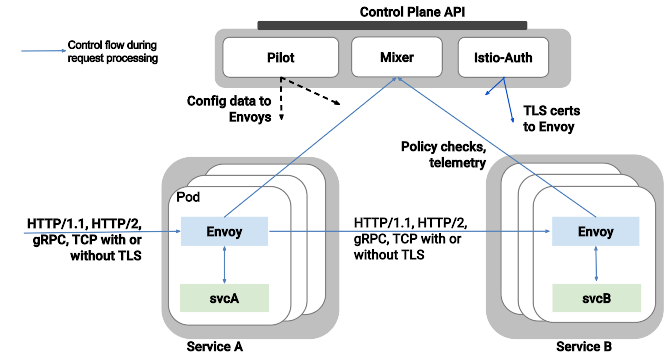

#### Istio Components

##### Envoy
Envoy is a high-performance proxy developed in C++ which handles all inbound and outbound traffic for all services in the service mesh. Istio leverages Envoy’s many built-in features such as dynamic service discovery, load balancing, TLS termination, HTTP/2 & gRPC proxying, circuit breakers, health checks, staged rollouts with %-based traffic split, fault injection, and rich metrics.

Envoy is deployed as a sidecar to application services in the same Kubernetes pod. This allows Istio to extract a wealth of signals about traffic behavior as attributes, which in turn it can use in Mixer to enforce policy decisions, and be sent to monitoring systems to provide information about the behavior of the entire mesh.

##### Mixer
Mixer is a platform-independent component responsible for enforcing access control and usage policies across the service mesh and collecting telemetry data from the Envoy proxy and other services. The proxy extracts request level attributes, which are sent to Mixer for evaluation.

##### Pilot
Pilot provides service discovery for the Envoy sidecars, traffic management capabilities for intelligent routing (e.g., A/B tests, canary deployments, etc.), and resiliency (timeouts, retries, circuit breakers, etc.). It converts a high level routing rules that control traffic behavior into Envoy-specific configurations, and propagates them to the sidecars at runtime. Pilot abstracts platform-specifc service discovery mechanisms and synthesizes them into a standard format consumable by any sidecar that conforms to the Envoy data plane APIs.

##### Istio-Auth
Istio-Auth provides strong service-to-service and end-user authentication using mutual TLS, with built-in identity and credential management. It can be used to upgrade unencrypted traffic in the service mesh, and provides operators the ability to enforce policy based on service identity rather than network controls.

##### Add-ons
Several components are used to provide additional visualizations, metrics, and tracing functions:

* [Prometheus](https://prometheus.io/) - Systems monitoring and alerting toolkit
* [Grafana](https://grafana.com/) - Allows you to query, visualize, alert on and understand your metrics
* [Jaeger Tracing](http://jaeger.readthedocs.io/) - Distributed tracing to gather timing data needed to troubleshoot latency problems in microservice architectures
* [Servicegraph](https://istio.io/docs/tasks/telemetry/servicegraph.html#about-the-servicegraph-add-on) - generates and visualizes a graph of services within a mesh

We will use these in future steps in this scenario!

Check out the [Istio docs](https://istio.io/docs) for more details.

Is your Istio deployment complete? If so, then you're ready to move on!

## Install Sample Application

In this step, we'll install a sample application into the system. This application
is included in Istio itself for demonstrating various aspects of it, but the application
isn't tied exclusively to Istio - it's an ordinary microservice application that could be
installed to any OpenShift instance with or without Istio.

The sample application is called _Bookinfo_, a simple application that displays information about a
book, similar to a single catalog entry of an online book store. Displayed on the page is a
description of the book, book details (ISBN, number of pages, and so on), and a few book reviews.

The BookInfo application is broken into four separate microservices:

* **productpage** - The productpage microservice calls the details and reviews microservices to populate the page.
* **details** - The details microservice contains book information.
* **reviews** - The reviews microservice contains book reviews. It also calls the ratings microservice.
* **ratings** - The ratings microservice contains book ranking information that accompanies a book review.

There are 3 versions of the reviews microservice:

* Version v1 does not call the ratings service.
* Version v2 calls the ratings service, and displays each rating as 1 to 5 black stars.
* Version v3 calls the ratings service, and displays each rating as 1 to 5 red stars.

The end-to-end architecture of the application is shown below.


## Install Bookinfo

Run the following command:

`~/install-sample-app.sh`

The application consists of the usual objects like Deployments, Services, and Routes.

As part of the installation, we use Istio to "decorate" the application with additional
components (the Envoy Sidecars you read about in the previous step).

Let's wait for our application to finish deploying.
Execute the following commands to wait for the deployment to complete and result `successfully rolled out`:

`oc rollout status -w deployment/productpage-v1 && \
 oc rollout status -w deployment/reviews-v1 && \
 oc rollout status -w deployment/reviews-v2 && \
 oc rollout status -w deployment/reviews-v3 && \
 oc rollout status -w deployment/details-v1 && \
 oc rollout status -w deployment/ratings-v1`

## Access Bookinfo

Open the application in your browser to make sure it's working:

* Bookinfo Application running with Istio at 

`http://istio-ingress-istio-system.$ROUTE_SUFFIX/productpage`

It should look something like:


Reload the page multiple times. The three different versions of the Reviews service
show the star ratings differently - `v1` shows no stars at all, `v2` shows black stars,
and `v3` shows red stars:

* `v1`: 
* `v2`: 
* `v3`: 

That's because there are 3 versions of reviews deployment for our reviews service. Istio’s
load-balancer is using a _round-robin_ algorithm to iterate through the 3 instances of this service.

You should now have your OpenShift Pods running and have an Envoy sidecar in each of them
alongside the microservice. The microservices are productpage, details, ratings, and
reviews. Note that you'll have three versions of the reviews microservice:

`oc get pods --selector app=reviews`

```
reviews-v1-1796424978-4ddjj          2/2       Running   0          28m
reviews-v2-1209105036-xd5ch          2/2       Running   0          28m
reviews-v3-3187719182-7mj8c          2/2       Running   0          28m
```

Notice that each of the microservices shows `2/2` containers ready for each service (one for the service and one for its
sidecar).

Now that we have our application deployed and linked into the Istio service mesh, let's take a look at the
immediate value we can get out of it without touching the application code itself!


## Collecting Metrics

## Visualize the network

The Servicegraph service is an example service that provides endpoints for generating and visualizing a graph of services within a mesh. It exposes the following endpoints:

* `/graph` which provides a JSON serialization of the servicegraph
* `/dotgraph` which provides a dot serialization of the servicegraph
* `/dotviz` which provides a visual representation of the servicegraph

## Examine Service Graph

The Service Graph addon provides a visualization of the different services and how they are connected. Open the link:

* Bookinfo Service Graph (Dotviz) at 

`http://servicegraph-istio-system.$ROUTE_SUFFIX/dotviz`

It should look like:


This shows you a graph of the services and how they are connected, with some basic access metrics like
how many requests per second each service receives.

As you add and remove services over time in your projects, you can use this to verify the connections between services and provides
a high-level telemetry showing the rate at which services are accessed.

## Generating application load

To get a better idea of the power of metrics, let's setup an endless loop that will continually access
the application and generate load. We'll open up a separate terminal just for this purpose. Execute this command:

```
while true; do 
     curl -o /dev/null -s -w "%{http_code}\n" \ 
        http://istio-ingress-istio-system.[[HOST_SUBDOMAIN]]/productpage 
    sleep .2
done
```

This command will endlessly access the application and report the HTTP status result in a separate terminal window.

With this application load running, metrics will become much more interesting in the next few steps.

## Querying Metrics with Prometheus

[Prometheus](https://prometheus.io/) exposes an endpoint serving generated metric values. The Prometheus
add-on is a Prometheus server that comes pre-configured to scrape Mixer endpoints
to collect the exposed metrics. It provides a mechanism for persistent storage
and querying of Istio metrics.

Open the Prometheus UI:

* Prometheus UI at 

`http://prometheus-istio-system.$ROUTE_SUFFIX`

In the “Expression” input box at the top of the web page, enter the text: `istio_request_count`.
Then, click the **Execute** button.

You should see a listing of each of the application's services along with a count of how many times it was accessed.

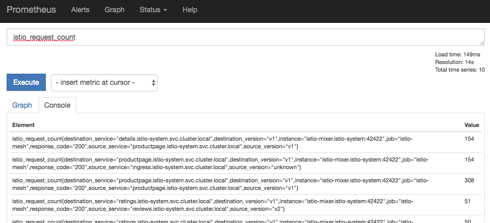

You can also graph the results over time by clicking on the _Graph_ tab (adjust the timeframe from 1h to 1minute for
example):


Other expressions to try:

* Total count of all requests to `productpage` service: `istio_request_count{destination_service=~"productpage.*"}`
* Total count of all requests to `v3` of the `reviews` service: `istio_request_count{destination_service=~"reviews.*", destination_version="v3"}`
* Rate of requests over the past 5 minutes to all `productpage` services: `rate(istio_request_count{destination_service=~"productpage.*", response_code="200"}[5m])`

There are many, many different queries you can perform to extract the data you need. Consult the
[Prometheus documentation](https://prometheus.io/docs) for more detail.

## Visualizing Metrics with Grafana

As the number of services and interactions grows in your application, this style of metrics may be a bit
overwhelming. [Grafana](https://grafana.com/) provides a visual representation of many available Prometheus
metrics extracted from the Istio data plane and can be used to quickly spot problems and take action.

Open the Grafana Dashboard:

* Grafana Dashboard at 

`http://grafana-istio-system.$ROUTE_SUFFIX/dashboard/db/istio-dashboard`


The Grafana Dashboard for Istio consists of three main sections:

1. **A Global Summary View.** This section provides high-level summary of HTTP requests flowing through the service mesh.
1. **A Mesh Summary View.** This section provides slightly more detail than the Global Summary View, allowing per-service filtering and selection.
1. **Individual Services View.** This section provides metrics about requests and responses for each individual service within the mesh (HTTP and TCP).

Scroll down to the `ratings` service graph:

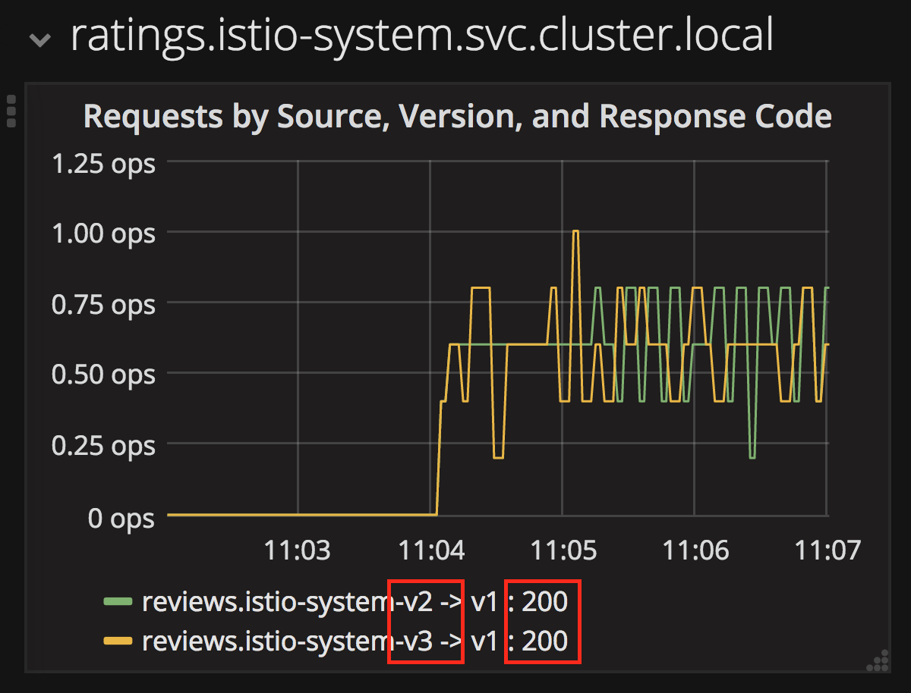

This graph shows which other services are accessing the `ratings` service. You can see that
`reviews:v2` and `reviews:v3` are calling the `ratings` service, and each call is resulting in
`HTTP 200 (OK)`. Since the default routing is _round-robin_, that means each reviews service is
calling the ratings service equally. And `reviews:v1` never calls it, as we expect.

For more on how to create, configure, and edit dashboards, please see the [Grafana documentation](http://docs.grafana.org/).

As a developer, you can get quite a bit of information from these metrics without doing anything to the application
itself. Let's use our new tools in the next section to see the real power of Istio to diagnose and fix issues in
applications and make them more resilient and robust.


## Request Routing

This task shows you how to configure dynamic request routing based on weights and HTTP headers.

_Route rules_ control how requests are routed within an Istio service mesh. Route rules provide:

* **Timeouts**
* **Bounded retries** with timeout budgets and variable jitter between retries
* **Limits** on number of concurrent connections and requests to upstream services
* **Active (periodic) health checks** on each member of the load balancing pool
* **Fine-grained circuit breakers** (passive health checks) – applied per instance in the load balancing pool

Requests can be routed based on
the source and destination, HTTP header fields, and weights associated with individual service versions.
For example, a route rule could route requests to different versions of a service.

Together, these features enable the service mesh to tolerate failing nodes and prevent localized failures from cascading instability to other nodes.
However, applications must still be designed to deal with failures by taking appropriate fallback actions.
For example, when all instances in a load balancing pool have failed, Istio will return HTTP 503. It is
the responsibility of the application to implement any fallback logic that is needed to handle the HTTP
503 error code from an upstream service.

If your application already provides some defensive measures (e.g. using [Netflix Hystrix](https://github.com/Netflix/Hystrix)), then that's OK:
Istio is completely transparent to the application. A failure response returned by Istio would not be
distinguishable from a failure response returned by the upstream service to which the call was made.

## Service Versions
Istio introduces the concept of a service version, which is a finer-grained way to subdivide
service instances by versions (`v1`, `v2`) or environment (`staging`, `prod`). These variants are not
necessarily different API versions: they could be iterative changes to the same service, deployed
in different environments (prod, staging, dev, etc.). Common scenarios where this is used include
A/B testing or canary rollouts. Istio’s [traffic routing rules](https://istio.io/docs/concepts/traffic-management/rules-configuration.html) can refer to service versions to
provide additional control over traffic between services.

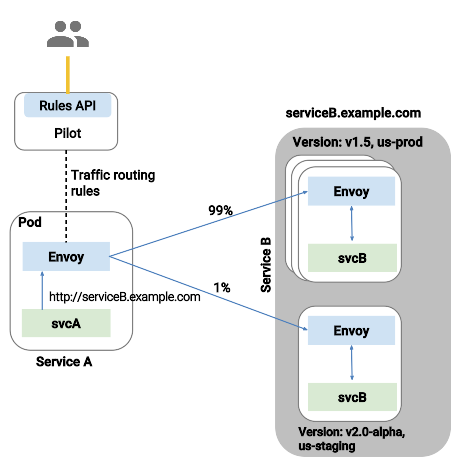

As illustrated in the figure above, clients of a service have no knowledge of different versions of the service. They can continue to access the services using the hostname/IP address of the service. The Envoy sidecar/proxy intercepts and forwards all requests/responses between the client and the service.

## RouteRule objects
In addition to the usual OpenShift object types like `BuildConfig`, `DeploymentConfig`, `Service` and `Route`,
you also have new object types installed as part of Istio like `RouteRule`. Adding these objects to the running
OpenShift cluster is how you configure routing rules for Istio.

## Install a default route rule
Because the BookInfo sample deploys 3 versions of the reviews microservice, we need to set a default route.
Otherwise if you access the application several times, you’ll notice that sometimes the output contains star
ratings. This is because without an explicit default version set, Istio will route requests to all available
versions of a service in a random fashion, and anytime you hit `v1` version you'll get no stars.

First, let's set an environment variable to point to Istio:

`export ISTIO_VERSION=0.6.0; export ISTIO_HOME=${HOME}/istio-${ISTIO_VERSION}; export PATH=${PATH}:${ISTIO_HOME}/bin; cd ${ISTIO_HOME}`

Now let's install a default set of routing rules which will direct all traffic to the `reviews:v1` service version:

`oc create -f samples/bookinfo/kube/route-rule-all-v1.yaml`

You can see this default set of rules with:

`oc get routerules -o yaml`

There are default routing rules for each service, such as the one that forces all traffic to the `v1` version of the `reviews` service:

`oc get routerules/reviews-default -o yaml`

```yaml
    apiVersion: config.istio.io/v1alpha2
    kind: RouteRule
    metadata:
      name: reviews-default
      namespace: default
      ...
    spec:
      destination:
        name: reviews
      precedence: 1
      route:
      - labels:
          version: v1
```

Now, access the application again in your browser using the below link and reload the page several times - you should not see any rating stars since `reviews:v1` does not access the `ratings` service.

* Bookinfo Application with no rating stars at 

`http://istio-ingress-istio-system.$ROUTE_SUFFIX/productpage`

To verify this, open the Grafana Dashboard:

* Grafana Dashboard at 

`http://grafana-istio-system.$ROUTE_SUFFIX/dashboard/db/istio-dashboard`

Scroll down to the `ratings` service and notice that the requests coming from the reviews service have stopped:

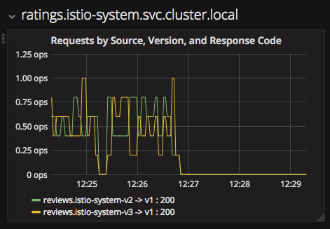

## A/B Testing with Istio
Lets enable the ratings service for a test user named “jason” by routing `productpage` traffic to `reviews:v2`, but only for our test user. Execute:

`oc create -f samples/bookinfo/kube/route-rule-reviews-test-v2.yaml`

Confirm the rule is created:

`oc get routerule reviews-test-v2 -o yaml`

Notice the `match` element:

```yaml
  match:
    request:
      headers:
        cookie:
          regex: ^(.*?;)?(user=jason)(;.*)?$
```

This says that for any incoming HTTP request that has a cookie set to the `jason` user to direct traffic to
`reviews:v2`.

Now, access the application at 

`http://istio-ingress-istio-system.$ROUTE_SUFFIX/productpage) and click **Sign In** (at the upper right` and sign in with:

* Username: `jason`
* Password: `jason`

> If you get any certificate security exceptions, just accept them and continue. This is due to the use of self-signed certs.

Once you login, refresh a few times - you should always see the black ratings stars coming from `ratings:v2`. If you logout,
you'll return to the `reviews:v1` version which shows no stars. You may even see a small blip of access to `ratings:v2` on the
Grafana dashboard if you refresh quickly 5-10 times while logged in as the test user `jason`.

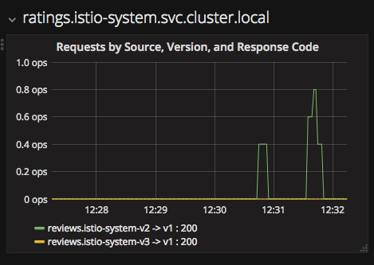

## Congratulations!

In this step, you used Istio to send 100% of the traffic to the v1 version of each of the BookInfo services.
You then set a rule to selectively send traffic to version v2 of the reviews service based on a header
(i.e., a user cookie) in a request.

Once the v2 version has been tested to our satisfaction, we could use Istio to send traffic from all users to
v2, optionally in a gradual fashion. We’ll explore this in the next step.


## Fault Injection

This step shows how to inject faults and test the resiliency of your application.

Istio provides a set of failure recovery features that can be taken advantage of by the services
in an application. Features include:

* Timeouts
* Bounded retries with timeout budgets and variable jitter between retries
* Limits on number of concurrent connections and requests to upstream services
* Active (periodic) health checks on each member of the load balancing pool
* Fine-grained circuit breakers (passive health checks) – applied per instance in the load balancing pool

These features can be dynamically configured at runtime through Istio’s traffic management rules.

A combination of active and passive health checks minimizes the chances of accessing an unhealthy service.
When combined with platform-level health checks (such as readiness/liveness probes in OpenShift), applications
can ensure that unhealthy pods/containers/VMs can be quickly weeded out of the service mesh, minimizing the
request failures and impact on latency.

Together, these features enable the service mesh to tolerate failing nodes and prevent localized failures
from cascading instability to other nodes.

## Fault Injection
While Istio provides a host of failure recovery mechanisms outlined above, it is still imperative to test the
end-to-end failure recovery capability of the application as a whole. Misconfigured failure
recovery policies (e.g., incompatible/restrictive timeouts across service calls) could result
in continued unavailability of critical services in the application, resulting in poor user experience.

Istio enables protocol-specific fault injection into the network (instead of killing pods) by
delaying or corrupting packets at TCP layer.

Two types of faults can be injected: delays and aborts. Delays are timing failures, mimicking
increased network latency, or an overloaded upstream service. Aborts are crash failures that
mimic failures in upstream services. Aborts usually manifest in the form of HTTP error codes,
or TCP connection failures.

## Inject a fault
To test our application microservices for resiliency, we will inject a 7 second delay between the
`reviews:v2` and `ratings` microservices, for user `jason`. This will be a simulated bug in the code which
we will discover later.

Since the `reviews:v2` service has a
built-in 10 second timeout for its calls to the ratings service, we expect the end-to-end flow
to continue without any errors. Execute:

`oc create -f samples/bookinfo/kube/route-rule-ratings-test-delay.yaml`

And confirm that the delay rule was created:

`oc get routerule ratings-test-delay -o yaml`

Notice the `httpFault` element:

```yaml
  httpFault:
    delay:
      fixedDelay: 7.000s
      percent: 100
```

Now, access the application at 

`http://istio-ingress-istio-system.$ROUTE_SUFFIX/productpage` and click **Login** and login with:

* Username: `jason`
* Password: `jason`

If the application’s front page was set to correctly handle delays, we expect it to load within
approximately 7 seconds. To see the web page response times, open the Developer Tools menu in
IE, Chrome or Firefox (typically, key combination `Ctrl`+`Shift`+`I` or `Alt`+`Cmd`+`I`), tab Network,
and reload the bookinfo web page.

You will see and feel that the webpage loads in about 6 seconds:

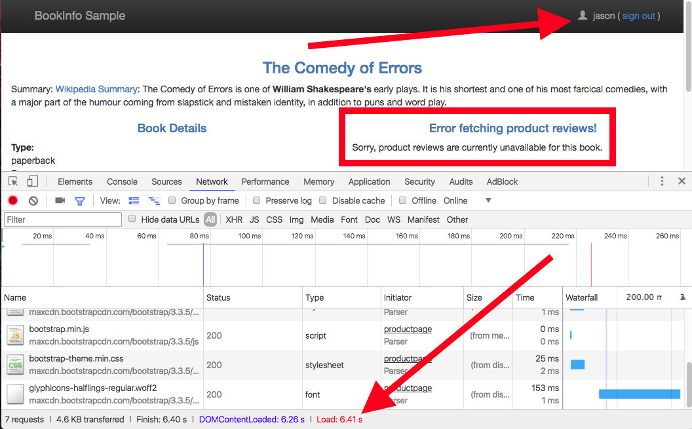

The reviews section will show: **Sorry, product reviews are currently unavailable for this book**:

## Use tracing to identify the bug
The reason that the entire reviews service has failed is because our BookInfo application has
a bug. The timeout between the `productpage` and `reviews` service is less (3s times 2 retries == 6s total)
than the timeout between the reviews and ratings service (10s). These kinds of bugs can occur in
typical enterprise applications where different teams develop different microservices independently.

Identifying this timeout mismatch is not so easy by observing the application, but is very easy when using
Istio's built-in tracing capabilities. We will explore tracing in depth later on in this scenario and re-visit
this issue.

## Fixing the bug
At this point we would normally fix the problem by either increasing the `productpage` timeout or
decreasing the `reviews` -> `ratings` service timeout, terminate and restart the fixed microservice,
and then confirm that the `productpage` returns its response without any errors.

However, we already have this fix running in `v3` of the reviews service, so we can simply fix the
problem by migrating all traffic to `reviews:v3`. We'll do this in the next step!


## Traffic Shifting

This step shows you how to gradually migrate traffic from an old to new version of a service.
With Istio, we can migrate the traffic in a gradual fashion by using a sequence of rules with
weights less than 100 to migrate traffic in steps, for example 10, 20, 30, … 100%. For simplicity
this task will migrate the traffic from `reviews:v1` to `reviews:v3` in just two steps: 50%, 100%.

## Remove test routes
Now that we've identified and fixed the bug, let's undo our previous testing routes. Execute:

`oc delete -f samples/bookinfo/kube/route-rule-reviews-test-v2.yaml \
           -f samples/bookinfo/kube/route-rule-ratings-test-delay.yaml`

At this point, we are back to sending all traffic to `reviews:v1`. Access the application at 

`http://istio-ingress-istio-system.$ROUTE_SUFFIX/productpage`
and verify that no matter how many times you reload your browser, you'll always get no ratings stars, since
`reviews:v1` doesn't ever access the `ratings` service:


Open the Grafana dashboard and verify that the ratings service is receiving no traffic at all:

* Grafana Dashboard at 

`http://grafana-istio-system.$ROUTE_SUFFIX/dashboard/db/istio-dashboard`

Scroll down to the `reviews` service and observe that all traffic from `productpage` to to `reviews:v2` and
`reviews:v3` have stopped, and that only `reviews:v1` is receiving requests:

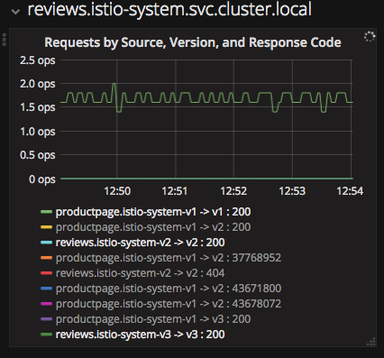

In Grafana you can click on each service version below each graph to only show one graph at a time. Try it by
clicking on `productpage.istio-system-v1 -> v1 : 200`. This shows a graph of all requests coming from
`productpage` to `reviews` version `v1` that returned HTTP 200 (Success). You can then click on
`productpage.istio-system-v1 -> v2 : 200` to verify no traffic is being sent to `reviews:v2`:

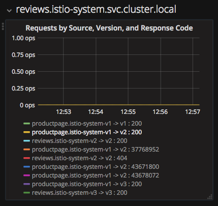

## Migrate users to v3

To start the process, let's send half (50%) of the users to our new `v3` version with the fix, to do a canary test.
Execute the following command which replaces the `reviews-default` rule with a new rule:

`oc replace -f samples/bookinfo/kube/route-rule-reviews-50-v3.yaml`

Inspect the new rule:

`oc get routerule reviews-default -o yaml`

Notice the new `weight` elements:

```yaml
  route:
  - labels:
      version: v1
    weight: 50
  - labels:
      version: v3
    weight: 50
```

Open the Grafana dashboard and verify this:

* Grafana Dashboard at 

`http://grafana-istio-system.$ROUTE_SUFFIX/dashboard/db/istio-dashboard`

Scroll down to the `reviews` service and observe that half the traffic goes to each of `v1` and `v3` and none goes
to `v2`:

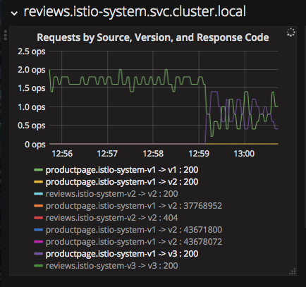


At this point, we see some traffic going to `v3` and are happy with the result. Access the application at 

`http://istio-ingress-istio-system.$ROUTE_SUFFIX/productpage`
and verify that you either get no ratings stars (`v1`) or _red_ ratings stars (`v3`).

We are now happy with the new version `v3` and want to migrate everyone to it. Execute:

`oc replace -f samples/bookinfo/kube/route-rule-reviews-v3.yaml`

Once again, open the Grafana dashboard and verify this:

* Grafana Dashboard at 

`http://grafana-istio-system.$ROUTE_SUFFIX/dashboard/db/istio-dashboard`

Scroll down to the `reviews` service and observe that all traffic is now going to `v3`:

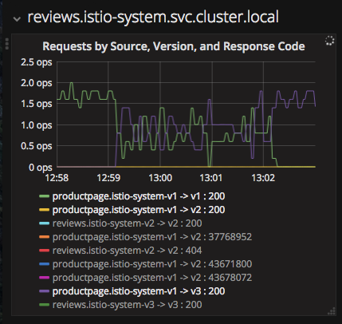

Also, Access the application at 

`http://istio-ingress-istio-system.$ROUTE_SUFFIX/productpage`
and verify that you always get _red_ ratings stars (`v3`).

## Congratulations!

In this task we migrated traffic from an old to new version of the reviews service using Istio’s
weighted routing feature. Note that this is very different than version migration using deployment
features of OpenShift, which use instance scaling to manage the traffic. With Istio, we can allow
the two versions of the reviews service to scale up and down independently, without affecting the
traffic distribution between them. For more about version routing with autoscaling, check out
[Canary Deployments using Istio](https://istio.io/blog/canary-deployments-using-istio.html).

In the next step, we will explore circuit breaking, which is useful for avoiding cascading failures
and overloaded microservices, giving the system a chance to recover and minimize downtime.


## Circuit Breaking

In this step you will configure an Istio Circuit Breaker to protect the calls from `reviews` to `ratings` service.
If the `ratings` service gets overloaded due to call volume, Istio (in conjunction with Kubernetes) will limit
future calls to the service instances to allow them to recover.

Circuit breaking is a critical component of distributed systems.
It’s nearly always better to fail quickly and apply back pressure downstream
as soon as possible. Istio enforces circuit breaking limits at the network
level as opposed to having to configure and code each application independently.

Istio supports various types of circuit breaking:

* **Cluster maximum connections**: The maximum number of connections that Istio will establish to all hosts in a cluster.
* **Cluster maximum pending requests**: The maximum number of requests that will be queued while waiting for a
ready connection pool connection.
* **Cluster maximum requests**: The maximum number of requests that can be outstanding to all hosts in a
cluster at any given time. In practice this is applicable to HTTP/2 clusters since HTTP/1.1 clusters are
governed by the maximum connections circuit breaker.
* **Cluster maximum active retries**: The maximum number of retries that can be outstanding to all hosts
in a cluster at any given time. In general Istio recommends aggressively circuit breaking retries so that
retries for sporadic failures are allowed but the overall retry volume cannot explode and cause large
scale cascading failure.

> Note that HTTP 2 uses a single connection and never queues (always multiplexes), so max connections and
max pending requests are not applicable.

Each circuit breaking limit is configurable and tracked on a per upstream cluster and per priority basis.
This allows different components of the distributed system to be tuned independently and have different limits.
See the [Istio Circuit Breaker Spec](https://istio.io/docs/reference/config/traffic-rules/destination-policies.html#istio.proxy.v1.config.CircuitBreaker) for more details.

## Enable Circuit Breaker
Let's add a circuit breaker to the calls to the `ratings` service. Instead of using a _RouteRule_ object,
circuit breakers in isto are defined as _DestinationPolicy_ objects. DestinationPolicy defines client/caller-side policies
that determine how to handle traffic bound to a particular destination service. The policy specifies
configuration for load balancing and circuit breakers.

Add a circuit breaker to protect calls destined for the `ratings` service:

```
oc create -f - <<EOF
    apiVersion: config.istio.io/v1alpha2
    kind: DestinationPolicy
    metadata:
      name: ratings-cb
    spec:
      destination:
        name: ratings
        labels:
          version: v1
      circuitBreaker:
        simpleCb:
          maxConnections: 1
          httpMaxPendingRequests: 1
          httpConsecutiveErrors: 1
          sleepWindow: 15m
          httpDetectionInterval: 10s
          httpMaxEjectionPercent: 100
EOF
```

We set the `ratings` service's maximum connections to 1 and maximum pending requests to 1. Thus, if we send more
than 2 requests within a short period of time to the reviews service, 1 will go through, 1 will be pending,
and any additional requests will be denied until the pending request is processed. Furthermore, it will detect any hosts that
return a server error (5XX) and eject the pod out of the load balancing pool for 15 minutes. You can visit
here to check the
[Istio spec](https://istio.io/docs/reference/config/traffic-rules/destination-policies.html#istio.proxy.v1.config.CircuitBreaker.SimpleCircuitBreakerPolicy)
for more details on what each configuration parameter does.

## Overload the service
Let's use some simple `curl` commands to send multiple concurrent requests to our application, and witness the
circuit breaker kicking in opening the circuit.

Execute this to simulate a number of users attampting to access the application simultaneously:

```
   for i in {1..10} ; do
        curl 'http://istio-ingress-istio-system.[[HOST_SUBDOMAIN]]/productpage?foo=[1-1000]' >& /dev/null &
   done
```

Due to the very conservative circuit breaker, many of these calls will fail with HTTP 503 (Server Unavailable). To see this,
open the Grafana console:

* Grafana Dashboard at 

`http://grafana-istio-system.$ROUTE_SUFFIX/dashboard/db/istio-dashboard`

>> **NOTE**: It make take 10-20 seconds before the evidence of the circuit breaker is visible
within the Grafana dashboard, due to the not-quite-realtime nature of Prometheus metrics and Grafana
refresh periods and general network latency.

Notice at the top, the increase in the number of **5xxs Responses** at the top right of the dashboard:


Below that, in the **Service Mesh** section of the dashboard observe that the services are returning 503 (Service Unavailable) quite a lot:


That's the circuit breaker in action, limiting the number of requests to the service. In practice your limits would be much higher

### Stop overloading

Before moving on, stop the traffic generator by entering the following command to stop them:

`for i in {1..10} ; do kill %${i} ; done`

## Pod Ejection

In addition to limiting the traffic, Istio can also forcibly eject pods out of service if they are running slowly
or not at all. To see this, let's deploy a pod that doesn't work (has a bug).

First, let's define a new circuit breaker, very similar to the previous one but without the arbitrary connection
limits. To do this, execute:

```
oc replace -f - <<EOF
    apiVersion: config.istio.io/v1alpha2
    kind: DestinationPolicy
    metadata:
      name: ratings-cb
    spec:
      destination:
        name: ratings
        labels:
          version: v1
      circuitBreaker:
        simpleCb:
          httpConsecutiveErrors: 1
          sleepWindow: 15m
          httpDetectionInterval: 10s
          httpMaxEjectionPercent: 100
EOF
```

This policy says that if any instance of the `ratings` service fails more than once, it will be ejected for
15 minutes.

Next, deploy a new instance of the `ratings` service which has been misconfigured and will return a failure
(HTTP 500) value for any request. Execute:

`${ISTIO_HOME}/bin/istioctl kube-inject -f ~/projects/ratings/broken.yaml | oc create -f -`

Verify that the broken pod has been added to the `ratings` load balancing service:

`oc get pods -l app=ratings`

You should see 2 pods, including the broken one:

```
NAME                                 READY     STATUS    RESTARTS   AGE
ratings-v1-3080059732-5ts95          2/2       Running   0          3h
ratings-v1-broken-1694306571-c6zlk   2/2       Running   0          7s
```

Save the name of this pod to an environment variable:

`BROKEN_POD_NAME=$(oc get pods -l app=ratings,broken=true -o jsonpath='{.items[?(@.status.phase=="Running")].metadata.name}')`

Requests to the `ratings` service will be load-balanced across these two pods. The circuit breaker will
detect the failures in the broken pod and eject it from the load balancing pool for a minimum of 15 minutes.
In the real world this would give the failing pod a chance to recover or be killed and replaced. For mis-configured
pods that will never recover, this means that the pod will very rarely be accessed (once every 15 minutes,
and this would also be very noticeable in production environment monitoring like those we are
using in this workshop).

To trigger this, simply access the application:

* Application Link at 

`http://istio-ingress-istio-system.$ROUTE_SUFFIX/productpage`

Reload the webpage 5-10 times (click the reload icon, or press `CMD-R`, or `CTRL-R`) and notice that you
only see a failure (no stars) ONE time, due to the
circuit breaker's policy for `httpConsecutiveErrors=1`.  After the first error, the pod is ejected from
the load balancing pool for 15 minutes and you should see red stars from now on.

Verify that the broken pod only received one request that failed:

`oc logs -c ratings $BROKEN_POD_NAME`

You should see:

```
Server listening on: http://0.0.0.0:9080
GET /ratings/0
```

You should see one and only one `GET` request, no matter how many times you reload the webpage.
This indicates that the pod has been ejected from the load balancing pool and will not be accessed
for 15 minutes. You can also see this in the Prometheus logs for the Istio Mixer. Open the Prometheus query
console:

* Prometheus UI at 

`http://prometheus-istio-system.$ROUTE_SUFFIX`

In the “Expression” input box at the top of the web page, enter the text: `envoy_cluster_out_ratings_istio_system_svc_cluster_local_http_version_v1_outlier_detection_ejections_active` and click
**Execute**. This expression refers to the number of _active ejections_ of pods from the `ratings:v1` destination that have failed more than the value of the `httpConsecutiveErrors` which
we have set to 1 (one).

Then, click the Execute button.

You should see a result of `1`:

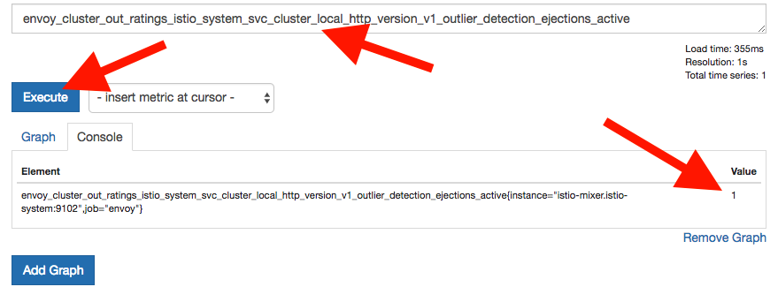

In practice this means that the failing pod will not receive any traffic for the timeout period, giving it a chance
to recover and not affect the user experience.

## Congratulations!

Circuit breaking is a critical component of distributed systems. When we apply a circuit breaker to an
entity, and if failures reach a certain threshold, subsequent calls to that entity should automatically
fail without applying additional pressure on the failed entity and paying for communication costs.

In this step you implemented the Circuit Breaker microservice pattern without changing any of the application code.
This is one additional way to build resilient applications, ones designed to deal with failure rather than go to great lengths
to avoid it.

In the next step, we will explore rate limiting, which can be useful to give different service levels to
different customers based on policy and contractual requirements

#### Before moving on

Before moving on, in case your simulated user loads are still running, kill them with:

`for i in {1..10} ; do kill %${i}; done`

## More references

* [Istio Documentation](https://istio.io/docs)
* [Christian Posta's Blog on Envoy and Circuit Breaking](http://blog.christianposta.com/microservices/01-microservices-patterns-with-envoy-proxy-part-i-circuit-breaking/)


## Rate Limiting

In this step we will use Istio's Quota Management feature to apply
a rate limit on the `ratings` service.

## Quotas in Istio
Quota Management enables services to allocate and free quota on a
based on rules called _dimensions_. Quotas are used as a relatively
simple resource management tool to provide some fairness between
service consumers when contending for limited resources.
Rate limits are examples of quotas, and are handled by the
[Istio Mixer](https://istio.io/docs/concepts/policy-and-control/mixer.html).

## Generate some traffic

As before, let's start up some processes to generate load on the app. Execute this command:

```
while true; do 
     curl -o /dev/null -s -w "%{http_code}\n" \ 
        http://istio-ingress-istio-system.[[HOST_SUBDOMAIN]]/productpage 
    sleep .2
done
```

This command will endlessly access the application and report the HTTP status result in a separate terminal window.

With this application load running, we can witness rate limits in action.

## Add a rate limit

Execute the following command:

`oc create -f samples/bookinfo/kube/mixer-rule-ratings-ratelimit.yaml`

This configuration specifies a default 1 qps (query per second) rate limit. Traffic reaching
the `ratings` service is subject to a 1qps rate limit. Verify this with Grafana:

* Grafana Dashboard at 

`http://grafana-istio-system.$ROUTE_SUFFIX/dashboard/db/istio-dashboard`

Scroll down to the `ratings` service and observe that you are seeing that some of the requests sent
from `reviews:v3` service to the `ratings` service are returning HTTP Code 429 (Too Many Requests).

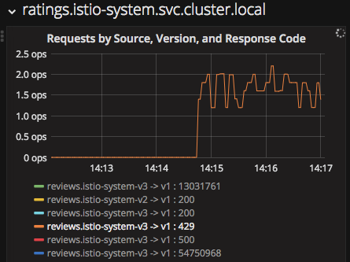

In addition, at the top of the dashboard, the '4xxs' report shows an increase in 4xx HTTP codes. We are being
rate-limited to 1 query per second:


## Inspect the rule

Take a look at the new rule:

`oc get memquota handler -o yaml`

In particular, notice the _dimension_ that causes the rate limit to be applied:

```yaml
# The following override applies to 'ratings' when
# the source is 'reviews'.
- dimensions:
    destination: ratings
    source: reviews
  maxAmount: 1
  validDuration: 1s
```

You can also conditionally rate limit based on other dimensions, such as:

* Source and Destination project names (e.g. to limit developer projects from overloading the production services during testing)
* Login names (e.g. to limit certain customers or classes of customers)
* Source/Destination hostnames, IP addresses, DNS domains, HTTP Request header values, protocols
* API paths
* [Several other attributes](https://istio.io/docs/reference/config/mixer/attribute-vocabulary.html)

## Remove the rate limit

Before moving on, execute the following to remove our rate limit:

`oc delete -f samples/bookinfo/kube/mixer-rule-ratings-ratelimit.yaml`

Verify that the rate limit is no longer in effect. Open the dashboard:

* Grafana Dashboard at 

`http://grafana-istio-system.$ROUTE_SUFFIX/dashboard/db/istio-dashboard`

Notice at the top that the `4xx`s dropped back down to zero.

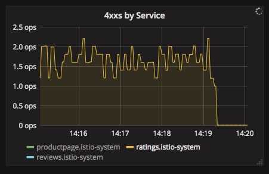

## Congratulations!

In the final step, we'll explore distributed tracing and how it can help diagnose and fix issues in
complex microservices architectures. Let's go!


## Tracing

This step shows you how Istio-enabled applications automatically collect
_trace spans_ telemetry and can visualize it with tools like using Jaeger or Zipkin.
After completing this task, you should
understand all of the assumptions about your application and how to have it
participate in tracing, regardless of what language/framework/platform you
use to build your application.

## Tracing Goals
Developers and engineering organizations are trading in old, monolithic systems
for modern microservice architectures, and they do so for numerous compelling
reasons: system components scale independently, dev teams stay small and agile,
deployments are continuous and decoupled, and so on.

Once a production system contends with real concurrency or splits into many
services, crucial (and formerly easy) tasks become difficult: user-facing
latency optimization, root-cause analysis of backend errors, communication
about distinct pieces of a now-distributed system, etc.

#### What is a trace?
At the highest level, a trace tells the story of a transaction or workflow as
it propagates through a (potentially distributed) system. A trace is a directed
acyclic graph (DAG) of _spans_: named, timed operations representing a
contiguous segment of work in that trace.

Each component (microservice) in a distributed trace will contribute its
own span or spans. For example:


This type of visualization adds the context of time, the hierarchy of
the services involved, and the serial or parallel nature of the process/task
execution. This view helps to highlight the system's critical path. By focusing
on the critical path, attention can focus on the area of code where the most
valuable improvements can be made. For example, you might want to trace the
resource allocation spans inside an API request down to the underlying blocking calls.

## Access Jaeger Console
With our application up and our script running to generate loads, visit the Jaeger Console:

* Jaeger Query Dashboard at 

`http://jaeger-query-istio-system.$ROUTE_SUFFIX`

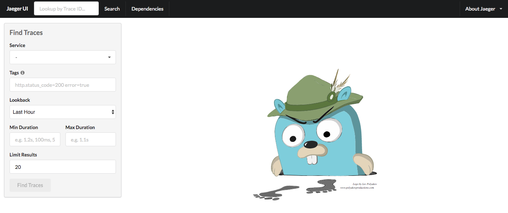

Select `istio-ingress` from the _Service_ dropdown menu, change the value of **Limit Results** to `200` and click **Find Traces**:


In the top right corner, a duration vs. time scatter plot gives a visual representation of the results, showing how and when
each service was accessed, with drill-down capability. The bottom right includes a list of all spans that were traced over the last
hour (limited to 200).

If you click on the first trace in the listing, you should see the details corresponding
to a recent access to `/productpage`. The page should look something like this:


As you can see, the trace is comprised of _spans_, where each span corresponds to a
microservice invoked during the execution of a `/productpage` request.

The first line represents the external call to the entry point of our application controlled by `istio-ingress`. Under it are the calls to the `productpage` service. Each line below represents the internal calls to the other services to construct the result, including the time it took for each service to respond.

To demonstrate the value of tracing, let's re-visit our earlier timeout bug! If you recall, we had
injected a 7 second delay in the `ratings` microservice for our user _jason_. So when we loaded the
web page it should have taken 7 seconds before showing the star ratings.

In reality, the webpage loaded in 6 seconds and we saw no rating stars! Why did this happen? We know
from earlier that it was because the timeout from `reviews`->`ratings` was much shorter than the `ratings`
timeout itself, so it prematurely failed the access to `ratings` after 2 retries (of 3 seconds each), resulting
in a failed webpage after 6 seconds. But can we see this in the tracing? Yes, we can!

To see this bug, open the Jaeger tracing console:

* Jaeger Query Dashboard at 

`http://jaeger-query-istio-system.$ROUTE_SUFFIX`

Since users of our application were reporting lengthy waits of 5 seconds or more, let's look for traces
that took at least 5 seconds. Select these options for the query:

* **Service**: `istio-ingress`
* **Min Duration**: `5s`

Then click **Find Traces**. Change the sorting to **Longest First** to see the ones that took the longest.
The result list should show several spans with errors:


Click on the top-most span that took ~10s and open details for it:


Here you can see the `reviews` service takes 2 attempts to access the `ratings` service, with each attempt
timing out after 3 seconds. After the second attempt, it gives up and returns a failure back to the product
page. Meanwhile, each of the attempts to get ratings finally succeeds after its fault-injected 7 second delay,
but it's too late as the reviews service has already given up by that point.

The timeouts are incompatible, and need to be adjusted. This is left as an exercise to the reader.

Istio’s fault injection rules and tracing capabilities help you identify such anomalies without impacting end users.

## Before moving on

Let's stop the load generator running against our app. Navigate to **Terminal 2** and type
`CTRL-C` to stop the generator or click `clear`.

## Congratulations!

Distributed tracing speeds up troubleshooting by allowing developers to quickly understand
how different services contribute to the overall end-user perceived latency. In addition,
it can be a valuable tool to diagnose and troubleshoot distributed applications.


## Summary

In this scenario you used Istio to implement many of the
Istio provides an easy way to create a network of deployed services with load balancing, service-to-service authentication, monitoring, and more, without requiring any changes in service code. You add Istio support to services by deploying a special sidecar proxy throughout your environment that intercepts all network communication between microservices, configured and managed using Istio’s control plane functionality.

Technologies like containers and container orchestration platforms like OpenShift solve the deployment of our distributed
applications quite well, but are still catching up to addressing the service communication necessary to fully take advantage
of distributed microservice applications. With Istio you can solve many of these issues outside of your business logic,
freeing you as a developer from concerns that belong in the infrastructure. Congratulations!

Additional Resources:

* [Istio on OpenShift via Veer Muchandi](https://github.com/VeerMuchandi/istio-on-openshift)
* [Envoy resilience examples](http://blog.christianposta.com/microservices/00-microservices-patterns-with-envoy-proxy-series/)
* [Istio and Kubernetes workshop from KubeCon 2017 via Zach Butcher, et. al.]()
* [Istio and Kubernetes workshop](https://github.com/retroryan/istio-workshop)
* [Bookinfo from http://istio.io](https://istio.io/docs/tasks/traffic-management/request-routing.html)


## Appendix

The contents of these files are used during this scenario exercise. Please refer to the scenario for how to use them!

### File: `install-istio.sh`

```bash
#!/usr/bin/env bash

ISTIO_VERSION=0.6.0
ISTIO_HOME=${HOME}/istio-${ISTIO_VERSION}

# shut down previous labs if needed
oc get -n coolstore-dev dc/coolstore >& /dev/null && oc scale --replicas=0 dc/coolstore dc/coolstore-postgresql -n coolstore-dev ; \
oc get -n coolstore-prod dc/coolstore-prod >& /dev/null && oc scale --replicas=0 dc/coolstore-prod dc/coolstore-postgresql dc/jenkins -n coolstore-prod ; \
oc get -n inventory dc/inventory >& /dev/null && oc scale --replicas=0 dc/inventory dc/inventory-database -n inventory ; \
oc get -n catalog dc/catalog >& /dev/null && oc scale --replicas=0 dc/catalog dc/catalog-database -n catalog ; \
oc get -n cart dc/cart >& /dev/null && oc scale --replicas=0 dc/cart -n cart

# workaround for https://github.com/istio/issues/issues/34
setenforce 0

# install istio
curl -kL https://git.io/getLatestIstio | sed 's/curl/curl -k /g' | ISTIO_VERSION=${ISTIO_VERSION} sh -
export PATH="$PATH:${ISTIO_HOME}/bin"
cd ${ISTIO_HOME}

oc new-project istio-system
oc adm policy add-scc-to-user anyuid -z istio-ingress-service-account
oc adm policy add-scc-to-user privileged -z istio-ingress-service-account
oc adm policy add-scc-to-user anyuid -z istio-egress-service-account
oc adm policy add-scc-to-user privileged -z istio-egress-service-account
oc adm policy add-scc-to-user anyuid -z istio-pilot-service-account
oc adm policy add-scc-to-user privileged -z istio-pilot-service-account
oc adm policy add-scc-to-user anyuid -z istio-grafana-service-account -n istio-system
oc adm policy add-scc-to-user anyuid -z istio-prometheus-service-account -n istio-system
oc adm policy add-scc-to-user anyuid -z prometheus -n istio-system
oc adm policy add-scc-to-user privileged -z prometheus
oc adm policy add-scc-to-user anyuid -z grafana -n istio-system
oc adm policy add-scc-to-user privileged -z grafana
oc adm policy add-scc-to-user anyuid -z default
oc adm policy add-scc-to-user privileged -z default
oc adm policy add-cluster-role-to-user cluster-admin -z default

oc apply -f install/kubernetes/istio.yaml
oc create -f install/kubernetes/addons/prometheus.yaml
oc create -f install/kubernetes/addons/grafana.yaml
oc create -f install/kubernetes/addons/servicegraph.yaml
oc apply -f https://raw.githubusercontent.com/jaegertracing/jaeger-kubernetes/master/all-in-one/jaeger-all-in-one-template.yml

oc expose svc grafana
oc expose svc servicegraph
oc expose svc jaeger-query
oc expose svc istio-ingress
oc expose svc prometheus


```

### File: `install-sample-app.sh`

```bash
#!/usr/bin/env bash

ISTIO_VERSION=0.6.0
ISTIO_HOME=${HOME}/istio-${ISTIO_VERSION}
export PATH="$PATH:${ISTIO_HOME}/bin"

cd ${ISTIO_HOME}

oc project istio-system
istioctl kube-inject -f samples/bookinfo/kube/bookinfo.yaml | oc apply -f -

```

